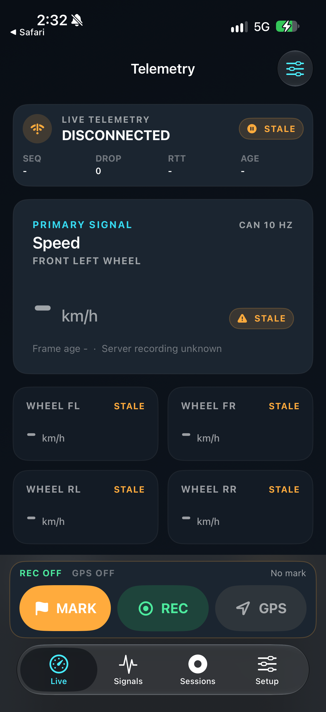
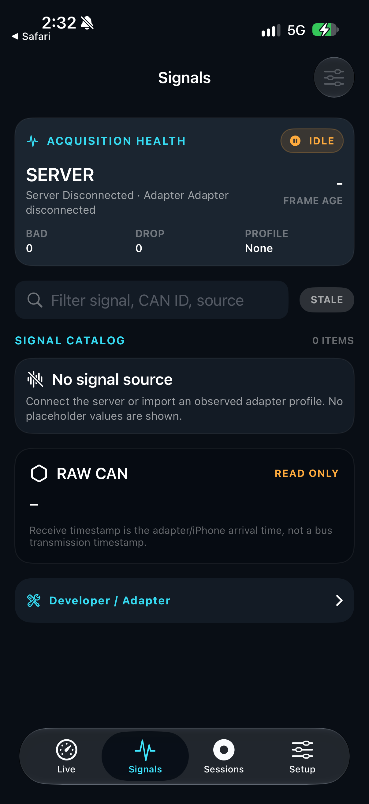
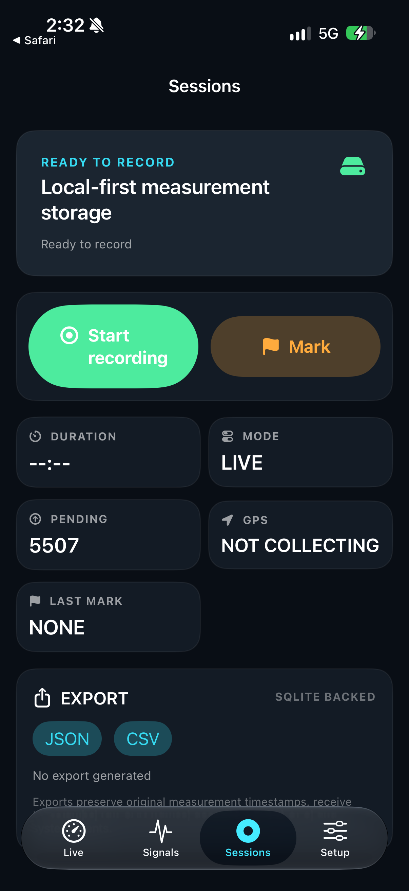

# Latest main: iPhone 17 physical deployment

## Checkpoint

- CURRENT MAIN SHA / installed production source: `17441ce999cfc4ee14bc16d634fd8703ac83c158`.
- APP VERSION/BUILD: `0.22.2 (18)`, bundle `local.webdashboard.Telemetry`, device family `1`.
- CHANGED FILES: this report and `evidence/ios27-device-20261002/` only. No production source or version change.
- WHY: verify the newly synchronized main on the connected physical phone without deleting or overwriting measurement records.
- Host: macOS 27.0; Xcode 27.0 (`27A266a`); iPhoneOS SDK 27.0.
- Physical device: iPhone 17 (`iPhone18,3`), iOS 27.0 (`24A437`), Developer Mode enabled, wired and paired. Not iPhone 17 Pro.
- Evidence collected on 2026-10-02, Asia/Seoul. Clean UI capture completed at 14:32; final signed-app install/launch and data read-back completed before 14:36.

## Acceptance and execution

1. Preserve user changes and data; fast-forward canonical main to the verified remote.
2. Build, install and launch the existing native app; keep each gate separate.
3. Navigate the four top-level tabs and verify idle Home/foreground return; capture actual device screens.
4. Compare persistent records and configuration before/after; retain private backups outside Git and publish only reviewed, redacted evidence.

Local main was safely fast-forwarded from `0e2e8eb` by 11 commits. The existing tracked/untracked `mobile/` user changes were not staged, reset or modified. Before/after hashes of its three tracked modified files matched.

## Results

| Gate | Result | Evidence / limit |
|---|---|---|
| Native device build | PASS | Signed `Debug-iphoneos/Telemetry.app`, Xcode 27 / SDK 27 |
| Physical installation | PASS | `devicectl device install app`; same bundle, no uninstall |
| Physical launch | PASS | `devicectl` launch plus observed app process, including final reinstall/read-back |
| Core unit tests | PASS | Fresh local SwiftPM run: 207 tests, 0 failures; runs on Mac, not device |
| App coordinator source probe | PASS | 23 assertions, 0 failures; OS/upload/store doubles, not UIKit/hardware |
| Profile import source probe | PASS | 12 assertions, 0 failures; profile/GATT substitutes, real Foundation file I/O |
| Physical top-level UI | PASS | Live, Signals, Sessions, Setup; corrected XCTest run: 1 test, 0 failures, 28.552 s |
| Idle Home / foreground return | PASS | Home button, five-second wait, activate; Live status exists and screenshot captured |
| Existing data preservation | PASS | SQLite quick_check `ok`; 23 sessions / 6,394 rows, zero missing or changed preexisting rows or sessions |
| Dashboard configuration preservation | PASS | Exact byte comparison; SHA-256 `82440e831a8e4cff7cf96328d3edf713771ccbbcdafc9bcfba72d6cfd71ae728` |
| Simulator | NOT TESTED | No simulator run in this checkpoint; prior CI is not physical evidence |
| Physical GPS recording / continuity | NOT TESTED | GPS and recording remained OFF |
| Collection while switching apps | NOT TESTED | Idle return does not prove active acquisition continuity |
| Physical diagnostic E2E | BLOCKED | PHYSICAL HARDWARE REQUIRED: powered, connected vehicle adapter not yet confirmed |
| Physical passive raw CAN | BLOCKED | PHYSICAL HARDWARE REQUIRED: no bus frame acquired |
| CarPlay entitlement / head-unit runtime | NOT TESTED | Not implied by iPhone launch or UI test |
| iPad / Android / screen lock | OUT OF SCOPE | Not exercised |

The first UI attempt failed because the test looked for `signals-health-card` only as an `otherElement`; accessibility exposed it on descendants. Correcting the locator to `descendants(matching: .any).matching(identifier: ...).firstMatch` passed without changing the app. The failed xcresult remains private; it was not hidden or counted as a product fix.

The original snapshots contained the user's video Picture-in-Picture overlay. One reversible drag folded it to the edge without closing playback. Only the subsequently unobstructed Live/Signals/Sessions/idle-return captures are published. Setup and raw logs/data backups remain private. `executed-ui-test.swift` records the exact one-off executed test, including that observed-overlay gesture; it is an evidence artifact, not an automatically enabled regression test. Do not blindly repeat the coordinate gesture on a different layout.

## Artifact identity

- Initial standalone signed build executable SHA-256: `ea46c2817c3744121eab04539313944877a80e4848c79ba1e8ffa6e058c6144c`.
- Final test-build executable SHA-256: `abe5a4fa7a45dd01373a04bc4dbb1e040256730e6cb6ffd8da7dd376bf3c6f40`.
- The latter local signed app was explicitly reinstalled and launched after the UI runs. These hashes identify local executable artifacts, not independently retrieved installed binaries or distribution packages. XCTest rebuilt the staged project; production source remained at the SHA above.
- Private build, xcresult, container backups and raw logs are retained outside Git under a restrictive temporary directory. Device serial/UDID, records, coordinates and identifiers are not published.

## Observed UI and remaining acceptance

Live accurately shows DISCONNECTED / STALE, no numerical measurement, REC OFF and GPS OFF. Signals shows IDLE, no profile and no signal source. Sessions shows Ready to record and the existing optional-upload pending count 5,507; this is not a missing-local-record count. This checkpoint did not enqueue, upload or delete data.

Screenshots establish these visible states only, not exhaustive widget/editor/export/replay acceptance. The static `CAN 10 HZ` badge is not observed acquisition throughput. The Setup first-run server requirement is legacy wording and is not proof that native BLE acquisition needs a server. These presentation gaps are recorded, not silently accepted as final-product readiness. No redesign or unrelated feature work was performed.

## Reproduction

Use the actual connected device ID locally; never commit it:

```bash
export DEVICE_UDID='<connected physical iPhone UDID>'
export ARTIFACT_DIR="$(mktemp -d /tmp/telemetry-physical-build.XXXXXX)"
bash mobile-ios/scripts/build_device.sh
DEVICE_ID="$DEVICE_UDID" \
  APP_PATH="$ARTIFACT_DIR/derived/Build/Products/Debug-iphoneos/Telemetry.app" \
  bash mobile-ios/scripts/verify_device.sh
swift test --package-path "$ARTIFACT_DIR/source/TelemetryCore"
python3 scripts/verify_telemetry_model.py
python3 scripts/verify_profile_import.py
python3 scripts/validate_platform_docs.py
```

For a comparable read-only UI check, copy the recorded XCTest into the staged `UITests/`, review/remove the one-off PiP gesture for the current screen, regenerate `project.yml` with XcodeGen, then run:

```bash
cd "$ARTIFACT_DIR/source"
xcodegen generate --spec project.yml
xcodebuild -project Telemetry.xcodeproj -scheme Telemetry \
  -destination "id=$DEVICE_UDID" \
  -derivedDataPath "$ARTIFACT_DIR/derived" \
  -resultBundlePath "$ARTIFACT_DIR/physical-ui.xcresult" \
  -only-testing:TelemetryUITests/PhysicalDeploymentTests/testInstalledMainScreensAndIdleAppReturn \
  test
```

Do not substitute screenshot assertions for recording/vehicle acceptance. Data comparisons used full preexisting measurement columns (sequence, session ID, kind, source timestamp, receive epoch, receive monotonic, payload JSON) and full session columns, not counts alone.

## Next gates

- NEXT AUTOMATIC ACTION: record/push this checkpoint and verify remote synchronization; proceed to actual adapter discovery once the powered vehicle setup is confirmed.
- NEXT HUMAN ACTION: answer the existing bundled hardware question: is NANICAR BT4N powered in the safely parked Santa Fe MX5 HEV, or is only the iPhone connected? No repeat trust/unlock request is needed now.
- BLOCKERS: no current GATT, ELM response, manufacturer signal, simultaneous real GPS, CSV/export/replay or endurance evidence from this deployment.
- Final product remains incomplete until the real vehicle diagnostic/raw evidence and the distinct CarPlay gates are met.

## Screenshots





