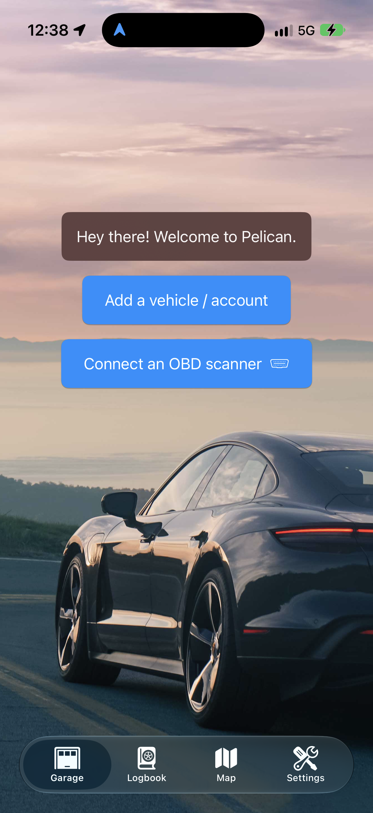
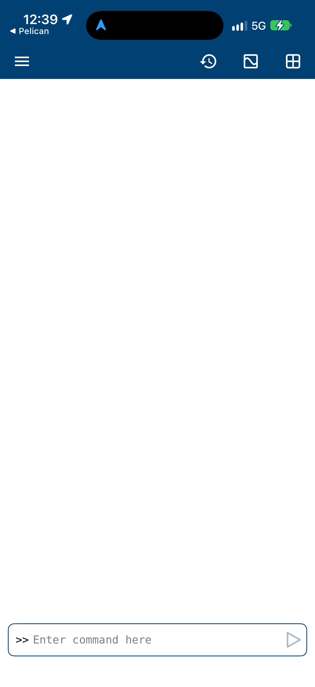

# Pelican and MATLAB Mobile Benchmark

Date: 2026-09-28
Scope: iPhone telemetry dashboard, BLE/ELM327, GPS, recording, CarPlay

## Evidence Boundary

The physical iPhone is connected for this project. The initial developer-only app listing hid third-party apps, so the complete `devicectl --include-all-apps` inventory was used. It confirmed:

- Pelican: `com.featherless.apps.electricsidecar`, version `5.0.3`.
- MATLAB Mobile: `com.mathworks.matlab`, version `9.12`.

Xcode Device Hub was then used to launch each bundle with `devicectl` and capture the actual iPhone display. iPhone Mirroring remains unavailable on this Mac because it shows an iCloud synchronization error, and Device Hub exposes capture but not touch automation. Therefore the physical evidence covers launch/initial UI states; deeper in-app navigation remains explicitly `NOT TESTED`.

The benchmark combines direct physical screenshots, live official product sites, App Store listings, and official documentation. Physical app behavior and published product claims are kept as separate evidence classes.

## Physical iPhone Evidence

### Pelican launch screen

Observed on the connected iPhone after launching `com.featherless.apps.electricsidecar`:

- Welcome screen with a full-bleed vehicle/road hero image.
- Large primary CTAs: `Add a vehicle / account` and `Connect an OBD scanner`.
- Persistent bottom navigation: `Garage`, `Logbook`, `Map`, `Settings`.
- This directly confirms the official site's onboarding and logbook/navigation claims at the initial screen level.

### MATLAB Mobile launch state

Observed on the connected iPhone after launching `com.mathworks.matlab`:

- Top bar with hamburger menu, history, figure/results, and app/grid controls.
- Centered `Connecting to MathWorks Cloud` state with spinner and `Cancel`.
- Bottom command entry field is present but disabled while the cloud connection is pending.
- The capture is a real runtime state, not a product-page mockup; it also confirms the Cloud/account dependency described in the official documentation.

## Pelican

### Official product identity

- Official product site: https://pelican.clutch.engineering/
- Scanning guide: https://pelican.clutch.engineering/scanning/
- Feature overview: https://pelican.clutch.engineering/features/
- Help and export guidance: https://pelican.clutch.engineering/help/
- Vehicle support catalog: https://pelican.clutch.engineering/cars/
- Shortcuts: https://pelican.clutch.engineering/shortcuts/
- App Store listing: https://apps.apple.com/us/app/pelican-automotive-assistant/id1663683832

The App Store listing identifies Pelican as a Navigation app named “Pelican: Automotive assistant”. It presents CarPlay, navigation, OBD, and vehicle widgets as the primary product surfaces. The live listing exposed an iPhone screenshot carousel, 4.0/5 from 82 ratings, iOS 18 or later compatibility, and in-app ScanPlan/ScanPass subscriptions. These values are time-sensitive App Store metadata, not compatibility guarantees for this project.

The physical launch screenshot confirms that the initial UX prioritizes vehicle/account setup and scanner connection before exposing Garage, Logbook, Map, and Settings.

### Functional inventory

- Navigation and CarPlay-oriented driving experience.
- Built-in OBD-II scanning with DTC and PID-oriented workflows.
- Real-time vehicle parameters and trip logging.
- Logbook and scan-session database export through a share sheet.
- Vehicle-data export with a redact-identifying-data option.
- Apple Shortcuts actions for parameter reads, climate workflows, and automation.
- Vehicle support catalog searchable by make/model.
- Leaderboard and beta program as engagement surfaces.
- Scanner discovery supporting BTLE, Wi-Fi, and classic Bluetooth; the site recommends BTLE for automatic nearby reconnection.
- Help content warns that another scanner app can hold the connection and prevent Pelican discovery.

### Scanner table cross-check

The official scanning page exposes country radio controls and a tested-scanner table with `Supported`, transport type, approximate PIDs/second, and price columns. The US table contained 36 product rows at the time of inspection.

| Observed example | Transport | Pelican support | Published rate |
| --- | --- | --- | --- |
| Generic ELM327 Bluetooth OBD2 Scanner | BTLE | No | up to 4.7 PIDs/s |
| Vgate iCar Pro Bluetooth 4.0 | BTLE | Yes | up to 34 PIDs/s |
| Vgate iCar Pro 2S | BTLE | Yes | up to 34 PIDs/s |
| Veepeak OBDCheck BLE+ | BTLE | Yes | up to 17 PIDs/s |
| Vgate vLinker MC+ | BTLE | Yes | up to 34 PIDs/s |
| MeatPi WICAN Pro | Wi-Fi / BTLE | Yes | up to 153 / 17 PIDs/s |
| vLinker FS / MS | Classic Bluetooth | Yes | up to 58 / 62 PIDs/s |

The table is useful as a product benchmark, not as a protocol specification. The NANICAR BT4N in this project is not listed by identity in the observed table and must be verified from its actual GATT services and characteristics. The table also demonstrates why the current project must not assume that a product labeled ELM327 is compatible.

### Layout patterns

- Marketing/site layout: large hero section, short feature cards, numbered onboarding, and a dense tested-hardware table.
- Scanner flow: find OBD port, select hardware, connect, then read diagnostics/parameters.
- Operational information architecture: vehicle tab, Logbook/scan sessions, Settings/Storage, and export/share actions.
- Trust cues: explicit unsupported hardware list, privacy/VIN warnings, and compatibility catalog.
- Dashboard pattern: navigation remains primary while vehicle values are glanceable widgets rather than a raw CAN debugger.

## MATLAB Mobile

### Official product identity

- Product page: https://www.mathworks.com/products/matlab-mobile.html
- Official documentation: https://www.mathworks.com/help/matlabmobile/
- Sensor collection documentation: https://www.mathworks.com/help/matlabmobile/sensor-data-collection.html
- Cloud connection documentation: https://www.mathworks.com/help/matlabmobile/connect-to-the-mathworks-cloud.html
- File editing documentation: https://www.mathworks.com/help/matlabmobile/edit-matlab-files.html
- App Store listing: https://apps.apple.com/us/app/matlab-mobile/id370976661

The App Store listing identifies MATLAB Mobile as a free Business app from MathWorks, compatible with iOS 17 or later, with iPhone/iPad support. The live listing exposed 3.2/5 from 179 ratings, 28.1 MB size, and version 9.12 metadata. This is App Store metadata, not a quality or performance verdict.

The physical screenshot confirms that the app opens into a Cloud connection state with command input disabled until the session is available.

### Functional inventory

- Connect to MATLAB running in MathWorks Cloud.
- Access and synchronize MATLAB Drive files.
- Issue MATLAB commands and display figures.
- Create/edit MATLAB files with copy, paste, undo, redo, selection, and file management.
- Collect accelerometer, angular velocity, magnetic field, orientation, and position data.
- Position data includes latitude, longitude, altitude, horizontal accuracy, speed, and course.
- Save sensor data locally while offline or stream it to MATLAB Cloud, MATLAB Online, desktop MATLAB, or another device.
- Capture images, video, and audio for later MATLAB processing.
- Official function surface includes `mobiledev`, `mobiledevlist`, `accellog`, `angvellog`, `magfieldlog`, `orientlog`, `poslog`, `discardlogs`, `readMobileSensorData`, `readAudio`, camera, and snapshot APIs.

### Layout patterns

- Global product layout: MathWorks navigation, product context, documentation sidebar, local topic navigation, and content panels.
- App/product workflow: Files, Commands, Figures/results, Sensors, and Cloud/Drive connection.
- Analysis-first model: capture or stream data, then process and visualize it in MATLAB rather than presenting a dedicated automotive cockpit.
- Account/license boundary: Cloud access and advanced capabilities depend on MathWorks account/license state.
- Official docs expose a topic hierarchy for cloud connection, fundamentals, file editing, and sensor collection, which is a useful model for separating acquisition from analysis.

## Cross-Validation

| Claim | Pelican site | App Store | MATLAB product/docs | Result |
| --- | --- | --- | --- | --- |
| Vehicle acquisition | OBD-II, PID/DTC, scanner table | OBD and car widgets in product description | Device sensors, not vehicle CAN | Pelican is the closer UX benchmark for vehicle acquisition |
| GPS/location | Navigation, trip/logbook context | Location may be used in background | Position sensor fields and maps/examples | Both support location, but MATLAB is analysis-oriented |
| Recording/export | Scan-session and vehicle-data export | App-level export/privacy metadata | Local logs, MATLAB Drive, Cloud | Reuse export durability and provenance patterns from both |
| CarPlay | Explicit product positioning | Navigation category and CarPlay claim | No automotive/CarPlay product surface | Pelican is the CarPlay UX reference, not an entitlement reference |
| BLE transport | BTLE/Wi-Fi/classic support table | Hardware compatibility is product-specific | Not an ELM transport | Actual BT4N GATT evidence remains authoritative |

## Apply to WebDashboard

### Adopt

- Use a first-run sequence: permissions, adapter discovery, verified profile, recording readiness.
- Keep the live cockpit glanceable: connection state, stale state, primary metric, small secondary cards, REC, GPS, MARK.
- Keep a dedicated Sessions/Logbook surface with CSV/JSON export and explicit timestamps/quality fields.
- Provide a read-only BLE discovery screen with observed peripheral name/UUID/RSSI/GATT properties and a clear “profile not configured” state.
- Add a vehicle/profile catalog model later, but keep signal definitions and adapter profiles versioned and evidence-based.
- Preserve MATLAB-oriented exports: raw CAN, decoded signal samples, GPS, monotonic/epoch timestamps, and system events should be directly loadable in MATLAB or Python.
- Keep VIN and identifying data warnings visible when exporting.

### Do not copy

- Do not copy Pelican’s climate/control or arbitrary vehicle-control behavior; this project is read-only in Phase 1.
- Do not treat Pelican’s published PIDs/second as a guarantee for the NANICAR BT4N.
- Do not copy MATLAB Mobile’s Cloud dependency into the live cockpit; local-first recording is required for driving sessions.
- Do not present CarPlay entitlement or App Store category as proof of this app’s entitlement approval.

### Current gap status

- The current native dashboard already has the main cockpit, stale/disconnected states, GPS/recording controls, sessions/export, and read-only BLE discovery.
- Physical iPhone BLE scan is proven, but the real BT4N identity/GATT profile is not present in the observed environment.
- CarPlay scene wiring is now present and validator-checked, but entitlement approval and head-unit runtime remain separate gates.
- Pelican and MATLAB Mobile physical launch/initial UI exploration: `PASS`, with screenshots above. Full in-app workflow exploration is `NOT TESTED` because iPhone Mirroring is unavailable and Device Hub provides capture but not touch control in this environment.

## Recommendation

Use Pelican as the benchmark for automotive information architecture and hardware onboarding, and MATLAB Mobile as the benchmark for sensor provenance, local/offline logging, and analysis/export. Do not merge their products into one screen. The product should remain an iPhone-first glanceable cockpit with a separate diagnostic/profile editor and a separate analysis/export path.
