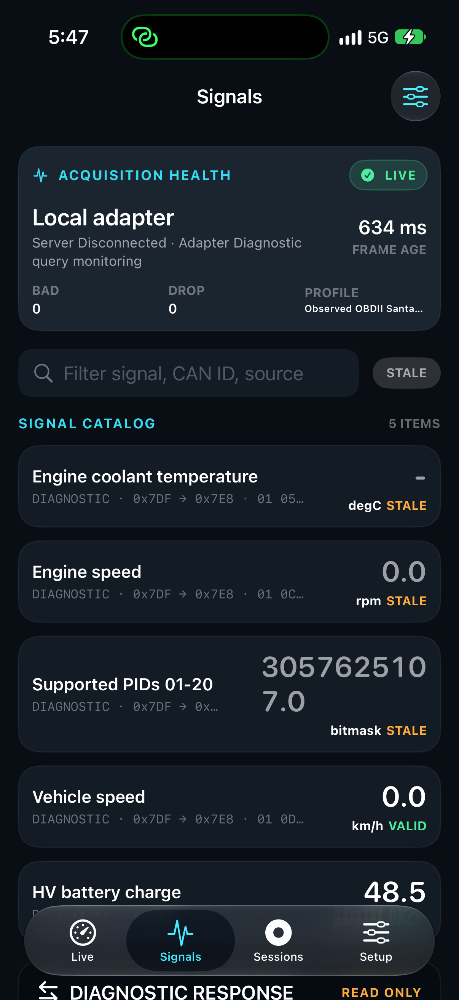
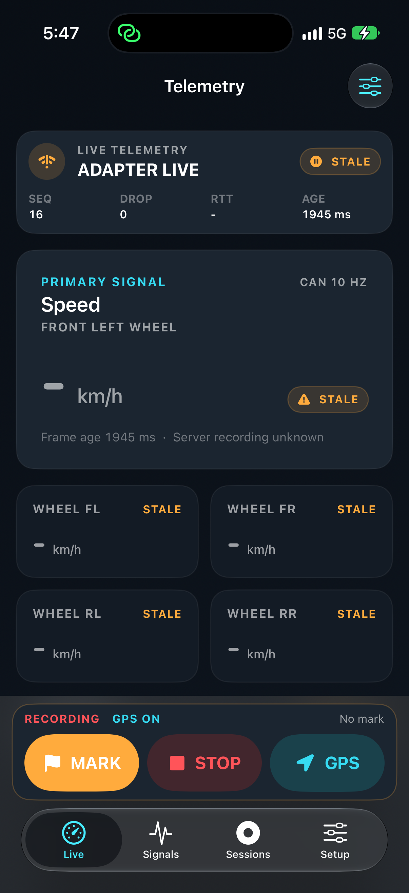

# First physical manufacturer signal capture

## Checkpoint

- CURRENT MAIN SHA / deployed production source: `910a8a73a2d92181dd75f33acd42a306e18d154b`.
- APP VERSION/BUILD: `0.22.3 (19)`; local test-build executable SHA-256 `f1d8fc9b017acd9cd16076d5a158a1f3a86ed24588ae37222a1488aa8a251364`.
- CHANGED FILES: BLEDiscoveryController, OBDQuerySession, regression tests, project version, GATT source probe, CI probe step and this evidence.
- WHY: physical GATT had three services and was rejected; the diagnostic session used CAF0 without supplying an ISO-TP PCI byte.
- TESTS: Core 208/208; GATT source probe 6/6; coordinator probe 23/23; import probe 12/12; physical bounded capture XCTest 1/1 (61.592 s); platform docs and workflow YAML validation.
- PHYSICAL EVIDENCE: iPhone 17/iOS 27.0; actual OBDII discovery, connection, service/characteristic discovery; saved profile; real ECU responses, numeric signal list and GPS recording in one closed local session.
- SIMULATOR EVIDENCE: NOT TESTED in this checkpoint.
- BLOCKERS / unverified acceptance: time-aligned RPM/Car Scanner comparison, multiple dashboard widget bindings, native file-export/replay UI, acquisition during app transition, disconnect/reconnect, 10-minute/one-hour endurance and latency percentile. Initial Face ID handoff was completed for the second capture.
- NEXT AUTOMATIC ACTION: use this captured golden regression and observed profile; validate native widget binding/export/replay, eliminate unsupported polling and measure acquisition cadence before endurance. No broad PID scan or UI redesign.
- NEXT HUMAN ACTION: provide the live cluster RPM around 18:05:35-18:06:05 KST and Car Scanner's same HV battery SOC value/unit/time while our query loop is stopped. Safely parked/P condition remains required.

## Executed path

```text
User's stationary Santa Fe MX5 HEV / OBDII BLE candidate
  -> observed FFF0 service / FFF2 write / FFF1 notify
  -> BLETransport -> OBDQuerySession -> parser/decoder
  -> TelemetryStore / Signals numeric list
  -> local MeasurementRecorder
Core Location -> same measurement session
Copied physical DB -> production CSV/JSON writer -> Replay/TelemetryStore on Mac
```

No server connection, mock transport, demo GPS or external telemetry upload was needed for this capture. No VIN identification was performed. The user reported the car/adapter context and confirmed OBDII was likely the same adapter; the advertisement name alone does not prove the hardware manufacturer or firmware version.

## GATT evidence

15-second physical scan found 80 peripherals, 27 named, and one OBD-name candidate. Only that candidate was inspected. Its private peripheral ID is intentionally omitted from public evidence; the phone's saved profile was compared with the captured ID and matched.

| Observed service | Characteristic | Properties |
|---|---|---|
| 1804 | 2A07 | read, write_without_response |
| 180F | 2A19 | read, notify |
| FFF0 | FFF1 | read, notify |
| FFF0 | FFF2 | write, write_without_response |

The fix selects the unique service containing both write and notify/indicate candidates, then requires exactly one distinct write and notify characteristic. It never combines ancillary services or hardcodes FFF0. Multiple duplex services or ambiguous characteristics remain rejected. Advertising service UUIDs, write size/MTU/chunk limits, indication delivery, disconnect/reconnect and sustained throughput have NOT TESTED status; discovery is not an ELM327 capability test.

## Reproduced fixes

1. Original GATT selection rejected the actual three-service layout (`serviceCountIsAmbiguous`). Production-method source probe: RED 1/6 failure; GREEN 6/6. This probe uses model substitutes, not live Bluetooth. The saved physical adapter profile then matched the observed FFF0/FFF2/FFF1 configuration.
2. Diagnostic requests contain only service/PID/DID. Original CAF0 initialization does not supply PCI automatically; the adapter-contract responder reproduced NO DATA. Changing diagnostic initialization to CAF1 keeps H1 response headers/PCI visible and supplies outbound formatting. RED 1 test failure, GREEN Core suite. Passive ELM327Session/AT MA/CAF0 monitoring was not changed.

Official basis: [ELM327 datasheet](https://www.elmelectronics.com/wp-content/uploads/2016/07/ELM327DS.pdf), printed pages 14 and 44: CAF0 requires caller-supplied PCI; CAF1 supplies outbound PCI, while H1 preserves received headers/PCI. Clone support is still judged from actual responses, not the datasheet alone.

An initial temporary XCTest was not registered in the generated project (0 tests; not counted as PASS). Later navigation failures were corrected using captured disclosure-chevron/row bounds and the exact accessibility image, without production UI changes. One runner launch reported an untrusted certificate; signed profiles/identity matched the previous working runner, local signature validation passed and direct device launch passed. That failed attempt was retained. Some large-list navigation overlapped a UI state change; the successful bounded test used the already saved, verified profile instead of scanning again. No unconfirmed UUID or unrelated peripheral was queried.

## Physical measurements

Bounded capture ended at approximately 17:47:15 KST. Session span was approximately 48.79 s; explicit query dwell was 30 s. The XCTest also includes navigation. Device CSV/JSON rows preserve actual epoch/monotonic times; public evidence masks session identifiers and omits GPS coordinates.

| Item | Count | Observed value/result |
|---|---:|---|
| Mode 01 supported PID bitmap | 4 | `0xB63FA813` |
| Engine RPM | 4 | decoded raw zero, not missing data; later cluster photo shows ~1,200 rpm, time-aligned comparison pending |
| Vehicle speed | 3 | genuine zero km/h |
| HV battery SOC | 3 | 48.5 percent |
| All diagnostic responses | 14 | source diagnostic, not passive raw CAN |
| All decoded diagnostic signals | 14 | paired with original response sequence and receive times |
| Real Core Location samples | 49 | valid coordinate ranges, horizontal accuracy 8.29-9.44 m; original timestamp/receive monotonic retained |
| System events | 19 | includes recording/GPS start/stop, adapter states/errors |
| New persisted records | 96 | session closed; SQLite quick_check ok |

SOC request/response: `0x7E4 -> 0x7EC`, service `22`, DID `0101`. Reassembled diagnostic payload is 59 bytes; payload byte 4 is decimal 97. Independent calculation: `97 / 2 = 48.5`. Three captured values agree. This is not a bus-timestamped passive CAN frame; ELM responses use iPhone receive timestamps.

SOC receive intervals were 10.0514 s and 9.9010 s, despite the profile's nominal 1 s polling preference. Acquisition is therefore approximately 0.10 Hz for this signal in this short multi-query run, not 10 Hz or even measured 1 Hz. The static CAN 10 HZ UI badge is misleading for diagnostics and remains an acceptance gap. No CAN-to-UI P95 was measured.

PID05 coolant is not supported in the observed bitmap; there was no successful coolant sample. Five generic adapter_error events occurred. The recorder does not include detailed failure text in those events, so assigning all five to a specific error code would be inference. Unsupported baseline polling must be removed/gated before endurance rather than labelling an unavailable coolant reading as zero.

## Durability, export and replay

- All 6,394 preexisting measurement rows remained byte-for-byte equivalent across their full columns; 24 total sessions after this new session, versus 23 before.
- The actual copied DB was opened through production MeasurementRecorder with the existing session ID/start time. CSV/JSON contained exactly 96 rows.
- CSV comparison checked sequence, session ID, kind, timestamps, monotonic and payload JSON against SQLite for every row. All 14 response/signal pairs matched sequence and both receive timestamps.
- Production MeasurementReplay restored SOC 48.5 into a fresh TelemetryStore. Recorder row count stayed 96. This was offline Mac verification of physical records, NOT iPhone UI export/replay and NOT a fresh vehicle acquisition test.
- Full GPS, private app container backups, original xcresult/video, profile ID and unmasked exports remain outside Git. Only application screenshots without coordinates/private identifiers and aggregate evidence are published.

## Gate matrix

| Gate | Verdict |
|---|---|
| SOFTWARE / regression and device build | PASS |
| Physical BLE discovery + GATT + saved profile | PASS |
| Physical diagnostic SOC -> numeric Signals -> durable recorder + real GPS | PASS, bounded capture only |
| Physical record -> production CSV/JSON -> Core replay on Mac | PASS, offline read-back only |
| Full PHYSICAL DIAGNOSTIC E2E acceptance (multiple live widgets, native export/replay, endurance) | NOT TESTED as a complete flow |
| Independent Car Scanner value comparison | NOT TESTED; user handoff pending |
| Passive RAW CAN | NOT TESTED |
| CARPLAY entitlement/head-unit runtime | NOT TESTED |
| iPad / Android / screen lock | OUT OF SCOPE |

Screenshots show the SOC numeric result, but the bottom row is partially covered by the tab bar. The Live default wheel-speed dashboard is unbound to this diagnostic SOC. Neither layout quality nor Gauge/Bar/LED acceptance is declared PASS. No new data was substituted to hide stale or unsupported fields.

## User-supplied instrument cluster reference

Four user photos received after the first capture show speed 0 km/h, P, READY, ~1.2 x 1000 rpm, ambient 23 C, range 175 km and odometer 26,103 km. Current trip is 0.0 km / 0:40 / 0.0 km/L; since refuel is 823.5 km / 27:31 / 16.9 km/L; accumulated is 26,103 km / 774:58 / 16.1 km/L. These are visual observations, not demonstrated OBD signal definitions.

The later ~1,200 rpm photograph conflicts with the first capture's zero reading if simultaneous, but simultaneity is not established. RPM correctness remains NOT TESTED until a new timestamped sample is compared with the live cluster; do not declare an engine-off explanation or silently rescale zero to match the photograph. The hybrid battery arc is not a numerical reference for SOC 48.5 percent. TPMS explicitly says it is displayed while driving and contains no pressure numbers: unknown/unavailable, never 0 psi. No road movement is requested just to fill that field. Raw user photos with surroundings remain private.

The attempted new RPM crosscheck at 18:01 KST was BLOCKED before test execution: `com.apple.LocalAuthentication Code=-2`, `Authentication canceled. Canceled by user.`, biometry Face ID. Device lock-state read-back said no passcode was required, so this is not labelled a locked-device or developer-trust failure. The test did not create a new recording or receive a new RPM result. No automatic authentication retry or bypass was attempted; the user owns that exact handoff.

After the user explicitly confirmed readiness, the 18:05-18:06 capture completed: physical XCTest 1/1, 65.524 s. Another closed session contains 14 diagnostic responses, 14 signals, 49 GPS and 19 system rows (96 total). SOC changed from 46.5 to 46.0 percent; captured raw bytes 93, 92, 92 independently agree. RPM responses at receive epochs 1790931935.2849832, 1790931945.2749481, 1790931955.1451049 and 1790931964.9549332 all contain payload `[0,0]`, giving zero RPM. Thus the zero is present before decoding, but accuracy versus the cluster remains NOT TESTED until the contemporaneous display is confirmed. Do not conclude clone firmware, ECU routing or engine state as root cause without additional evidence. Both sessions ended; total DB now 25 closed sessions / 6,586 records, quick_check ok.


## Reproducible software checks

```bash
python3 scripts/verify_ble_profile.py
python3 scripts/verify_telemetry_model.py
python3 scripts/verify_profile_import.py
python3 scripts/validate_platform_docs.py
```

Use `mobile-ios/scripts/build_device.sh` for the ASCII staged source directory, then `swift test --package-path "$ARTIFACT_DIR/source/TelemetryCore"`; the canonical NBSP-containing workspace causes Xcode response-file parsing errors. Core regression `testPhysicalSantaFeHVSOCReceivedOn20261002` pins this actual reassembled payload to independent 48.5. Hardware XCTest and original captured input remain private; do not reuse this evidence as a successful future hardware run.



